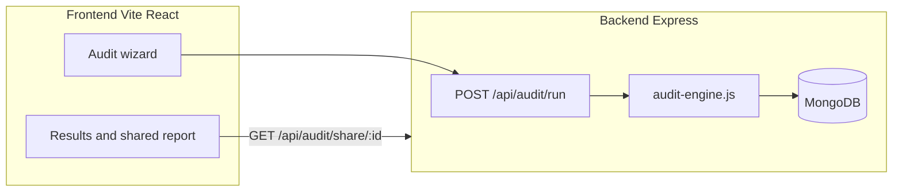

# Architecture

Related: [README.md](README.md) · [DEVLOG.md](DEVLOG.md) · [DEPLOYMENT.md](DEPLOYMENT.md)

## System diagram

## Data flow: input to audit result

1. User completes audit wizard (tools, plan, seats, optional **declared monthly spend** per tool, team size, primary use case, **usage intensity**).
2. Frontend posts `teamSize`, `primaryUseCase`, `usageIntensity`, optional honeypot `website` (must be empty), and `tools[]` to `POST /api/audit/run`.
3. Backend loads `tools.json` and `plans.json`, normalizes plan bundles (`orderedPlans` + per-plan `planFit.maxIntensity`).
4. For each tool, `audit-engine.js`:
   - Computes **seat waste** vs `teamSize`.
   - Lists cheaper plans sorted by price; filters by **usage fit** (`planFit.maxIntensity` vs declared intensity).
   - For `*_api` tools and **heavy** intensity, skips aggressive downgrades when monthly price delta × active seats exceeds a conservative threshold.
   - Emits `recommendationType`: `downgrade_plan`, `reduce_seats`, `keep_plan`, or `insufficient_data`, plus human-readable `reason`.
5. Totals, optional **Gemini** summary on the server (with instructions not to contradict `keep_plan` rows), and persistence on `Audit` + `SharedReport` documents.
6. **Client:** after a successful run, the SPA may persist a copy of the response in **`localStorage`** (`audit-local-storage.ts`) so `/results?shareId=…` can reload from the device if the share API returns 404. **Report resolution** (`report-loader.ts`): built-in `sample` id → static demo; else GET share; else local copy.

## Results routing (SPA)

- TanStack route **`/results`** validates search: empty `shareId` resolves to **latest stored** id, then **`sample`** ([frontend/src/routes/results.tsx](frontend/src/routes/results.tsx)).
- **Public OG-style route** `/report/:shareId` loads the same payload shape for lightweight sharing.

## Client-only summary (optional)

- Results page may call **Groq** from the browser (`useAISummary.ts`) when `VITE_GROQ_API_KEY` is set; fallback copy respects per-tool `recommendationType` so the narrative does not contradict the table.

## Stack choices (short)

- **Express + MongoDB**: simple persistence for audits and leads; fits a 7-day ship.
- **React + Vite**: fast UI for the audit funnel and shareable results.
- **Vitest** on the backend for pure audit math without booting HTTP.

## At 10k audits/day (what would change)

- Move audit recommendation to a **versioned rules package** loaded from object storage with cache; keep Mongo for metadata only.
- **Queue** email and LLM summary generation; return audit ID immediately.
- Add **read replicas** or a document store optimized for share-id lookups.
- **Rate limit** per IP + per email with Redis; shard heavy API heuristic config per tenant if needed.

## Downgrade guardrails (summary)

We **do not** recommend a cheaper plan when:

- Its `maxIntensity` in [backend/data/pricing/plans.json](backend/data/pricing/plans.json) is below the user’s declared **usage intensity** (e.g. Free for **heavy** ChatGPT).
- For hosted API tiers, a single-step price drop for **heavy** usage exceeds the configured delta guard (see [backend/src/services/audit-engine.js](backend/src/services/audit-engine.js)).

The client sidebar reuses the same intensity table in [frontend/src/lib/pricing/plan-fit.ts](frontend/src/lib/pricing/plan-fit.ts) — keep it aligned when plan metadata changes.
